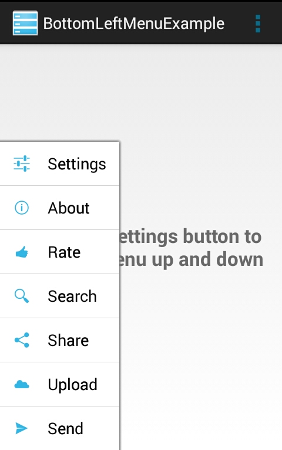

An easy to use menu view, located in the bottom left corner of the screen.
===================



Required min API level 11 
-------------------------

BASIC USAGE
-----------

Edit your gradle script to include the library:
```java
dependencies {
        compile 'com.rany.albeg.wein.bottomleftmenu:bottom-left-menu:1.0.1'
}
```

Add the menu to your XML layout file:
```java
<RelativeLayout
    xmlns:app="http://schemas.android.com/apk/res-auto"

    ...

    <com.rany.albeg.wein.bottomleftmenu.BottomLeftMenu
        android:id="@+id/bottom_left_menu"
        android:layout_width="wrap_content"
        android:layout_height="wrap_content"
        android:layout_alignParentBottom="true"

        <!-- Custom attributes ( values are set to default in this example ): -->

        app:itemNormalStateColor="@android:color/transparent"
        app:itemPressedStateColor="#0099cc"
        app:itemTextColor="@android:color/black"
        app:itemTextSize="12sp"
        app:openingDirection="bottom_top" <!-- More options are: left_right and fade_in-->
        app:showDivider="true"
        app:dividerHeight="1dp"
        app:dividerColor="#d3d3d3">

    </com.rany.albeg.wein.bottomleftmenu.BottomLeftMenu>

</RelativeLayout>
```
Use the menu in java code, like so:
```java
mMenu = (BottomLeftMenuView) findViewById(R.id.bottom_left_menu);
/*
 * Populate the menu with views.
 */
mMenu.addMenuItem(R.drawable.ic_action_settings, R.string.settings, _MENU_ID_SETTINGS);
mMenu.addMenuItem(R.drawable.ic_action_about, R.string.about, _MENU_ID_ABOUT);
mMenu.addMenuItem(R.drawable.ic_rating_good, R.string.rate, _MENU_ID_RATE);
mMenu.addMenuItem(R.drawable.ic_action_search, R.string.search, _MENU_ID_SEARCH);
mMenu.addMenuItem(R.drawable.ic_social_share, R.string.share, _MENU_ID_SHARE);
mMenu.addMenuItem(R.drawable.ic_collections_cloud, R.string.upload, _MENU_ID_UPLOAD);
mMenu.addMenuItem(R.drawable.ic_social_send_now, R.string.send, _MENU_ID_SEND);
/*
 * Set a listener for click events.
 */
mMenu.setOnBottomLeftMenuItemClickListener(this);
```
Handle click events:
```java
@Override
public void onClick(BottomLeftMenuItem item) {
    /*
     * getIdentifier(), not getId()
     */
    int id = item.getIdentifier();

    if (id == _MENU_ID_UPLOAD) {
        /* Upload something */
    }
    else if (id == _MENU_ID_SHARE) {
        /* Share something */
    }
    else if (id == _MENU_ID_SEND) {
        /* Send something */
    }

    // etc...
}
```
MORE FEATURES
-------------
**1**. Get a reference to each one of the items in the menu, by:
```java
BottomLeftMenuItem item = mMenu.getMenuItemAt(index);
TextView itemText= item.getTextView();
ImageView itemIcon = item.getImageView();
```
**2**. Implement your own custom animation for opening and closing the menu:
```java
mMenu.setOpenCloseAnimation(new OpenCloseMenuAnimation(this) {
    
    @Override
    public Animation open() {
        /* Return an Animation object for opening the menu. */
    }
    
    @Override
    public Animation close() {
        /* Return an Animation object for closing the menu. */
    }
});
```
EXTRA
--------
You might want to override **onBackPressed()** and **onKeyDown(int keyCode, KeyEvent event)** for opening and closing the menu:

```java
@Override
public boolean onKeyDown(int keyCode, KeyEvent event) {

    if (keyCode == KeyEvent.KEYCODE_MENU) {

        if (mMenu.isOpened())
            mMenu.closeMenu();
        else {
            mMenu.openMenu();
        }
        return true;
    }
    return super.onKeyDown(keyCode, event);
}

@Override
public void onBackPressed() {

    if (mMenu.isOpened()) {
        mMenu.closeMenu();
    } else {
        super.onBackPressed();
    }
}
```
AUTHOR
-------

**Rany Albeg Wein**


LICENSE
--------
Licensed under the Apache License, Version 2.0 (the "License");
you may not use this file except in compliance with the License.
You may obtain a copy of the License at

http://www.apache.org/licenses/LICENSE-2.0

Unless required by applicable law or agreed to in writing, software
distributed under the License is distributed on an "AS IS" BASIS,
WITHOUT WARRANTIES OR CONDITIONS OF ANY KIND, either express or implied.
See the License for the specific language governing permissions and
limitations under the License.
